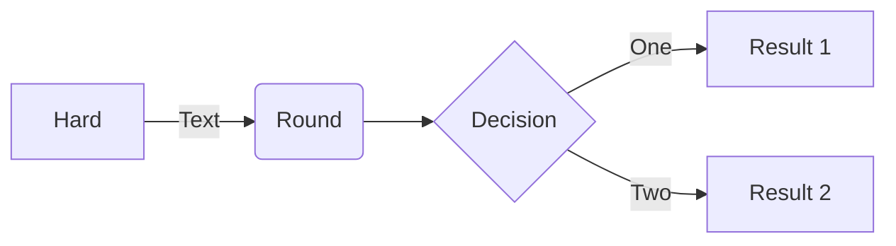

# Infraspec-Material3-React Install #

npm install
npm start

# Infraspec V2 #

	├── Account (custom dashboard per user)
|
	├── Dashboard Main # Devices status, Hardware Status, Weather, Daily Notifcations, Links #, Monthly/YTD Graphs. 
    ├── Trends # Include Temperature Graphs, AI Detection Results, Positive/Neutral/False Alarms, Export, Links #
	├── Notications # Temperature Warnings, Notifcations, Human, Vehicle, Temperature Alarms, Fire, Object Left, Images, Color Coded, Links) #
	    └── Calendar  # Temperature Warnings, Notifcations, Human, Vehicle, Temperature Alarms, Fire, Object Left, Color Coded) #
    └── Reports
        ├── Patrol Calendar
        └── Inspection Record
|
    ├── Device
        ├── Live View
        ├── NVR 1 (Dashboard)
        ├── Camera 1 (Dashboard)
        ├── Recordings (NVR for now)
        └── Settings
|
    ├── Location
	    ── Map
            ├── Country
            ├── State
            └── Site
        └── Substation 1
            └── Bay 1
                ├── Arestors
                ├── Disconnects
                ├── Circuit Breakers
                ├── Insulators
                ├── CTs
                ├── VTs
                ├── Capacitors
                └── Transformers
|
|
    └── Settings
	    ├── Basic
	    ├── Users
	    ├── Logs

        

I'm building for Angular 4/5 and often working offline and so the following worked for me. First install the NPM:

npm install material-design-icons --save

Then add the following to styles.css:

@import '~material-design-icons/iconfont/material-icons.css';

